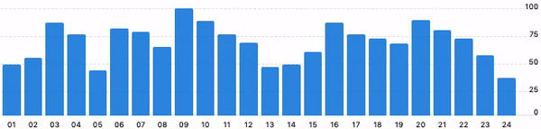

# jQuery Simple Bar Graph
Very simple plugin for generating bar charts based on key/value data



[Examples](https://maximzhurkin.github.io/jquery-simple-bar-graph/)

## Getting Started
### Include styles & scripts
```html
<head>
    <link href="jquery.simple-bar-graph.min.css" rel="stylesheet">
    <script src="jquery.min.js"></script>
    <script src="jquery.simple-bar-graph.min.js"></script>
</head>
```
### Add HTML
```html
<div id="graph"></div>
```
### Call plugin
```javascript
$(document).ready(function() {
    $('#graph').simpleBarGraph({
        data: [
            { key: 'Monday', value: 120 },
            { key: 'Tuesday', value: 96 },
            { key: 'Wednesday', value: 46 },
            { key: 'Thursday', value: 58 },
            { key: 'Friday', value: 64 },
            { key: 'Saturday', value: 108 },
            { key: 'Sunday', value: 91 }
        ]
    });
});
```
### Custom settings
```javascript
$('#graph').simpleBarGraph({
    data: [],
    rowsCount: 5,
    height: '200px',
    rowCaptionsWidth: '16px',
    barsColor: '#C496CF',
    popups: true,
    delayAnimation: 15 //ms
});
```